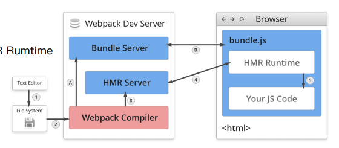
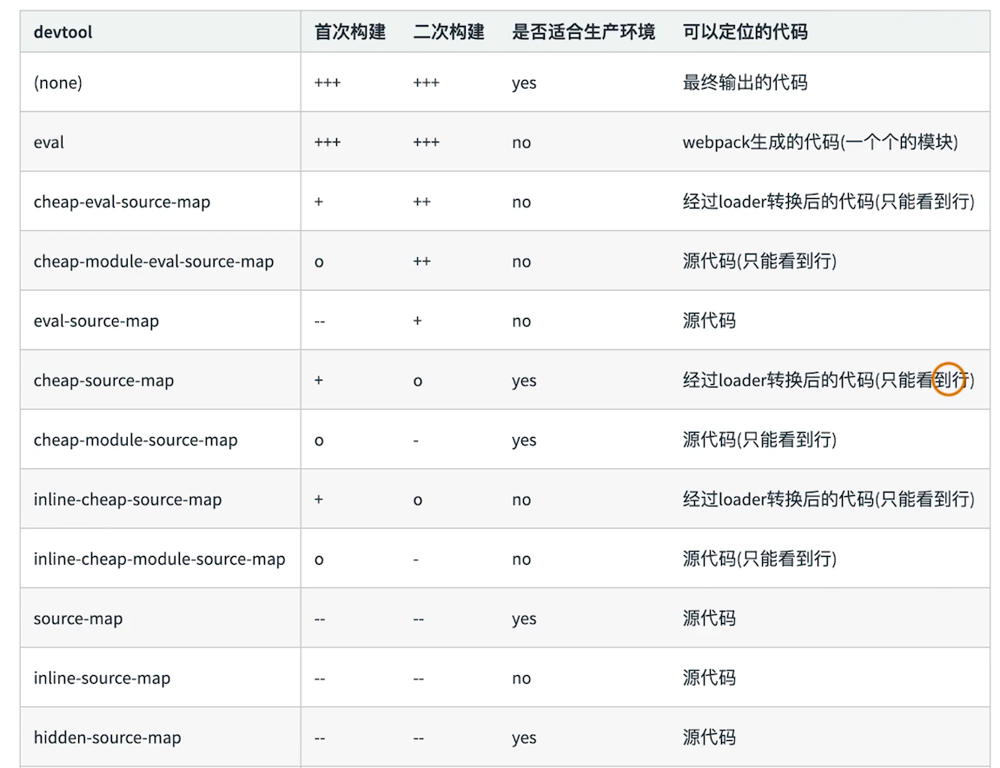

# webpack初级入门

## 环境安装

### 创建空目录和package.json

```shell
    mkdir webpack-primary
    cd webpack-primary
    npm init -y
```

### 开发环境安装webpack和webpack-cli

```shell
    npm install webpack webpack-cli -D
```

### 确认安装完毕

webpack4+会把webpack安装在以下目录

```shell
    ./node_modules/.bin/webpack -v
```

## 基础搭建

### 简单demo

#### 创建webpack.config.js

```js
    'use strict'

    const path = require('path');

    module.exports = {
        entry: './src/index.js',
        output: {
            path: path.join(__dirname, 'dist'),
            filename: 'bundle.js'
        },
        mode: 'production'
    }
```

#### src目录创建打包入口

```js
    // src/index.js
    import { helloworld } from "./helloworld";
    document.write(helloworld());
    

    // src/helloworld.js
    export function helloworld() {
        return 'helloworld'
    }
```

#### 执行命令

默认执行webpack.config.js

```shell
    ./node_modules/.bin/webpack
```

### npm script运行webpack

#### 通过npm run build进行构建

原理：因为package.json默认可以读取到node_modules/.bin目录（模块局部安装）创建的软链接

```json
    {
        "name": "webpack-primary",
        "version": "1.0.0",
        "description": "",
        "main": "index.js",
        "scripts": {
            "test": "echo \"Error: no test specified\" && exit 1",
            "build": "webpack"
        },
        "keywords": [],
        "author": "",
        "license": "ISC",
        "devDependencies": {
            "webpack": "^5.61.0",
            "webpack-cli": "^4.9.1"
        }
    }
```

## 基础用法

### entry

entry用于指定webpack打包的入口  

#### 用法

单入口：entry是一个字符串（单页应用）

```js
    module.exports = {
        entry: './path/to/my/entry/file.js'
    }
```

多入口：entry是一个对象（多页应用）

```js
    module.exports = {
        entry: {
            app: './src/app.js',
            helloworld: './src/helloworld.js'
        }
    }

```

### output

output用于告诉webpack如何将编译后的文件输出到磁盘

单入口

```js
    module.exports = {
        entry: './src/index.js',
        output: {
            path: path.join(__dirname, 'dist'),
            filename: 'bundle.js'
        },
    }
```

多入口  

```js
    module.exports = {
        entry: './src/index.js',
        output: {
            path: path.join(__dirname, 'dist'),
            filename: '[name].js' // 通过占位符确保文件名称唯一
        },
    }
```

### loader

webpack开箱即用只支持JS和JSON两种文件类型，通过Loaders去支持其他文件类型并且将它们转化成有效的模块，并且可以添加到依赖图中。  

本身是一个函数，接受源文件作文参数，返回转换的结果。  

#### 常用loader


#### 简单用法

```js
    const path = require('path');

    module.exports = {
        output: {
            filename: 'bundle.js'
        },
        module: {
            rules: [
                {
                    test: /\.txt$/, // 匹配规则
                    use: 'raw-loader' // 使用loader
                }
            ]
        }
    }
```

### plugins

插件用于bundle文件的优化，资源管理和环境变量注入  

作用于整个构建过程  

#### 常用plugins


#### 简单用法

```js
    const path = require('path');
    const HtmlWebpackPlugin = require('html-webpack-plugin');

    module.exports = {
        output: {
            filename: 'bundle.js'
        },
        plugins: [
            new HtmlWebpackPlugin({
                template: './src/index.html'
            })
        ]
    }
```

### mode

mode用来指定当前构建的环境：production、development还是none。根据不同环境默认启动默认plugin。  

设置mode可以使用webpack内置的函数，默认值为production  

### 解析es6语法

安装对应插件

```shell
    npm install @babel/core @babel/preset-env babel-loader -D
```

添加babel配置文件.babelrc

```js
    {
        "presets": [
            "@babel/preset-env" // 一系列proposal集合
        ]
    }
```

### 解析React JSX

安装对应插件，因为需要演示react所以也安装 react react-dom

```shell
    npm install react react-dom @babel/preset-react -D
```

添加babel配置文件.babelrc

```js
    {
        "presets": [
            "@babel/preset-react" 
        ]
    }
```

例子demo

```js
    'use strict'

    import React from "react"
    import ReactDOM from "react-dom"

    class Search extends React.Component {
        render() {
            return <div>Search Text</div>
        }
    }

    ReactDOM.render(
        <Search/>,
        document.getElementById('root')
    )
```

### 解析css

使用css-loader加载.css文件，并且转换成commonjs对象  

使用style-loader将样式通过`<style>`标签插入到head中  

安装插件

```shell
    npm install css-loader style-loader -D
```

webpack配置添加css解析所需loader

```js
'use strict'

module.exports = {
    module: {
        rules: [
            {
                test: /\.css$/,
                use: ['style-loader', 'css-loader']
            }
        ]
    }
}
```

简单demo

```js
    'use strict'

    import React from "react"
    import ReactDOM from "react-dom"
    import './assets/css/search.css'

    class Search extends React.Component {
        render() {
            return <div class="red">Search Text</div>
        }
    }

    ReactDOM.render(
        <Search/>,
        document.getElementById('root')
    )
```

```css
    .red {
        color: red;
    }
```

### 解析less

使用less-loader将less解析成css  

安装对应loader

```shell
    npm install less less-loader -D
```

在webpack配置添加less-loader

```js
'use strict'

module.exports = {
    module: {
        rules: [
            {
                test: /\.less$/,
                use: ['style-loader', 'css-loader', 'less-loader']
            }
        ]
    }
}
```

简单demo

```js
'use strict'

import React from "react"
import ReactDOM from "react-dom"
import './assets/css/search.less'

class Search extends React.Component {
    render() {
        return <div class="red">Search Text</div>
    }
}

ReactDOM.render(
    <Search/>,
    document.getElementById('root')
)
```

```less
.red {
    color: red;
}
```

### 解析图片和文件

使用file-loader处理文件  

安装对应loader

```shell
    npm install file-loader -D
```

webpack 添加配置

```js
module.exports = {
    module: {
        rules: [
            {
                test: /\.(png|svg|jpg|gif)$/,
                use: 'file-loader'
            },
            {
                test: /.(woff|woff2|eot|ttf|otf)$/,
                use: 'file-loader'
            }
        ]
    }
}
```

简单demo

```js
'use strict'

import React from "react"
import ReactDOM from "react-dom"
import './assets/css/search.less'
import loaderPng from "./assets/images/common-loader.png"

class Search extends React.Component {
    render() {
        return <div class="red">
            Search Text
            
        </div>
    }
}

ReactDOM.render(
    <Search/>,
    document.getElementById('root')
)

```

也可以使用url-loader，两个loader功能差不多只是url-loader能够做一些小图片、小字体转成base64，并且url-loader内部也是使用file-loader的。

安装对应loader

```shell
    npm install url-loader -D
```

webpack添加配置

```js
module.exports = {
    module: {
        rules: [
            {
                test: /\.(png|svg|jpg|gif)$/,
                use: [{
                    loader: 'url-loader',
                    options: {
                        limit: 10240
                    }
                }]
            },
        ]
    }
}
```

### 文件监听

文件监听是在源码发生变化时，自动重新构建出新得输出文件。  

webpack启动监听模式，有两种方法(都需要手动刷新浏览器)：  

> 启动webpack命令时，带上--watch参数  
> 在配置webpack.config.js中设置watch:true

```json
{
    "scripts": {
        "build": "webpack --watch",
    },
}
```

```js
module.exports = {
    watch: true
}
```

原理分析:  

webpack会轮询的判断文件的最后编译时间是否变化  
某个文件发生了变化，并不会立刻告诉监听者，而是先缓存起来，等aggregateTimeout

```js
module.exports = {
    watch: true, // 默认是false不开启
    watchOptions: { // 只有开启监听模式，watchOptions才有意义
        ignored: /node_modules/, // 不监听的文件
        aggregateTimeout: 1000, // 发生变化后等待时间后再编译，默认300ms
        poll: 1000 // 轮询时间，默认每秒问1000次
    }
}
```

### 热更新

热更新采用webpack-dev-server  
不刷新浏览器，而是放在内存中（watch时放在磁盘中），所以其构建速度有优势  
与HotModuleReplacementPlugin插件一起使用  

安装对应插件

```shell
    npm install webpack-dev-server -D
```

package.json添加dev启动命令

```json
{
    "scripts": {
        "dev": "webpack-dev-server",
    },
}
```

webpack.config.js添加对应命令

```js
'use strict'
const webpack = require('webpack');
module.exports = {
    mode: 'development',
    watchOptions: { // 只有开启监听模式，watchOptions才有意义
        ignored: /node_modules/, // 不监听的文件
        aggregateTimeout: 1000, // 发生变化后等待时间后再编译，默认300ms
        poll: 1000 // 轮询时间，默认每秒问1000次
    },
    plugins: [
        new webpack.HotModuleReplacementPlugin()
    ],
    devServer: {
        static: './dist',
        open: true
    }
}
```

原理分析：  

> Webpack Compile：将js编译成bundle  
> HMR Server：将热更新的文件输出给HMR Rumtime  
> Bundle Server: 提供文件在浏览器的访问  
> HMR Rumtime：会被注入到浏览器，更新文件的变化  
> bundle.js：构建输出的文件  



### 文件指纹

打包后输出的文件名的后缀，用于防缓存  

#### 如何生成文件指纹

Hash：和整个项目相关，只有项目文件有修改，整个项目构建的hash值都会更改。  
Chunkhash：和webpack打包的chunk有关，不同的entry会生成不同的chunkhash值。  
Contenthash：根据文件变化来定义hash，文件内容不变，则contenthash不变。  

JS文件指纹位置

```js
module.exports = {
    output: {
        filename: '[name].[chunkhash:8].js'
    },
}
```

css文件指纹位置  

设置MiniCssExtractPlugin的filename，MiniCssExtractPlugin.loader不能和style-loader一起使用，一个是提取css，一个是导入css

安装对应插件

```shell
npm install mini-css-extract-plugin -D
```

```js
const MiniCssExtractPlugin = require('mini-css-extract-plugin')
module.exports = {
        module: {
        rules: [
            {
                test: /\.css$/,
                use: [MiniCssExtractPlugin.loader, 'css-loader']
            },
            {
                test: /\.less$/,
                use: [MiniCssExtractPlugin.loader, 'css-loader', 'less-loader']
            },
        ]
    },
    plugins: [
        new MiniCssExtractPlugin({
            filename: '[name].[contenthash:8].css'
        })
    ],
}
```

图片的文件指纹位置

```js
module.exports = {
    module: {
        rules: [
            {
                test: /\.(png|svg|jpg|gif)$/,
                use: [{
                    loader: 'file-loader',
                    options: {
                        limit: 10240,
                        name: 'images/[name].[hash:8].[ext]'
                    }
                }]
            },
        }
    }
}
```

将webpack.config.js拆分为webpack.dev.js、webpack.prod.js

```js
// webpack.dev.js
'use strict'

const path = require('path');
const webpack = require('webpack');

module.exports = {
    entry: {
        index: './src/index.js',
        search: './src/search.js',
    },
    output: {
        path: path.join(__dirname, 'dist'),
        filename: '[name].js'
    },
    mode: 'development',
    watchOptions: { // 只有开启监听模式，watchOptions才有意义
        ignored: /node_modules/, // 不监听的文件
        aggregateTimeout: 1000, // 发生变化后等待时间后再编译，默认300ms
        poll: 1000 // 轮询时间，默认每秒问1000次
    },
    module: {
        rules: [
            {
                test: /.js$/,
                use: 'babel-loader'
            },
            {
                test: /\.css$/,
                use: ['style-loader', 'css-loader']
            },
            {
                test: /\.less$/,
                use: ['style-loader', 'css-loader', 'less-loader']
            },
            {
                test: /\.(png|svg|jpg|gif)$/,
                use: [{
                    loader: 'file-loader',
                    options: {
                        limit: 10240,
                        name: 'images/[name].[ext]'
                    }
                }]
            },
            {
                test: /.(woff|woff2|eot|ttf|otf)$/,
                use: 'file-loader'
            }
        ]
    },
    plugins: [
        new webpack.HotModuleReplacementPlugin(),
    ],
    devServer: {
        static: path.join(__dirname, './dist'),
        open: true
    }
}
```

```js
// webpack.prod.js
'use strict'

const path = require('path');
const MiniCssExtractPlugin = require('mini-css-extract-plugin')

module.exports = {
    entry: {
        index: './src/index.js',
        search: './src/search.js',
    },
    output: {
        path: path.join(__dirname, 'dist'),
        filename: '[name].[chunkhash:8].js'
    },
    mode: 'production',
    module: {
        rules: [
            {
                test: /.js$/,
                use: 'babel-loader'
            },
            {
                test: /\.css$/,
                use: [MiniCssExtractPlugin.loader, 'css-loader']
            },
            {
                test: /\.less$/,
                use: [MiniCssExtractPlugin.loader, 'css-loader', 'less-loader']
            },
            {
                test: /\.(png|svg|jpg|gif)$/,
                use: [{
                    loader: 'file-loader',
                    options: {
                        limit: 10240,
                        name: 'images/[name].[hash:8].[ext]'
                    }
                }]
            },
            {
                test: /.(woff|woff2|eot|ttf|otf)$/,
                use: 'file-loader'
            }
        ]
    },
    plugins: [
        new MiniCssExtractPlugin({
            filename: '[name].[contenthash:8].css'
        }),
    ],
}

```

### 代码压缩

js文件压缩使用的uglifyjs-webpack-plugin,webpack4+是已经内置了的，如果你有其他配置的话可以引入

安装相应插件

```shell
npm install uglifyjs-webpack-plugin -D
```

```js
const UglifyjsWebpackPlugin = require('uglifyjs-webpack-plugin')
module.exports = {
    plugins: [
        new UglifyjsWebpackPlugin()
    ],
}
```

css文件压缩使用的optimize-css-assets-webpack-plugin  
同时使用cssnano

安装相应插件

```shell
npm install optimize-css-assets-webpack-plugin -D
```

```js
const OptimizeCssAssetsWebpackPlugin = require('optimize-css-assets-webpack-plugin')
module.exports = {
    plugins: [
        new OptimizeCssAssetsWebpackPlugin({
            assertNameRegExp: /\.css$/g,
            csssProcessor: require('cssnano')
        })
    ],
}
```

html文件压缩  

修改html-webpack-plugin，设置压缩参数  

安装对应插件  

```shell
npm install html-webpack-plugin -D
```

webpack.config.js配置

```js
'use strict'
const HtmlWebpackPlugin = require('html-webpack-plugin')

module.exports = {
    plugins: [
        new HtmlWebpackPlugin({
            template: path.join(__dirname, 'src/search.html'),
            filename: 'search.html',
            chunks: ['search'],
            inject: true,
            minify: {
                html5: true,
                collapseWhitespace: true,
                preserveLineBreaks: false,
                minifyCSS: true,
                minifyJS: true,
                removeComments: false,
            }
        })
    ],
}

```

## 进阶用法

### 自动清理构建目标产物

使用clean-webpack-plugin默认会删除output指定的输出目录

安装对应插件

```shell
npm install clean-webpacl-plugin -D
```

webpack.prod.js添加对应配置

```js
const { CleanWebpackPlugin } = require('clean-webpack-plugin')
module.exports = {
    plugins: [
        new CleanWebpackPlugin()
    ]
}
```

### 自动补全css前缀

使用postcss插件autoprefixer自动补齐css3前缀  

安装相关插件、loader

```shell
npm install autoprefixer postcss postcss-loader -D
```

webpack相关配置

```js
'use strict'

module.exports = {
    module: {
        rules: [
            {
                test: /\.less$/,
                use: [
                    MiniCssExtractPlugin.loader,
                    'css-loader',
                    'less-loader',
                    {
                        loader: 'postcss-loader',
                        options: {
                            postcssOptions: {
                                plugins: [
                                    require('autoprefixer') //postcss-loader会叫autoprefixer插件添加浏览器前缀
                                ]
                            }
                        }
                    }
                ]
            },
        ]
    },
}
```

### css自动转为rem

使用px2rem-loader进行转换，后续需要知道1rem是多少px，可以借助页面渲染时计算根元素的font-size的值，可以使用手淘的lib-flexible库  

安装对应loader

```shell
npm install px2rem-loader -D
npm install lib-flexible -S
```

对应webpack配置

```js
module.exports = {
    module: {
        rules: [
            {
                test: /\.less$/,
                use: [
                    MiniCssExtractPlugin.loader,
                    'css-loader',
                    'less-loader',
                    {
                        loader: 'postcss-loader',
                        options: {
                            postcssOptions: {
                                plugins: [
                                    require('autoprefixer') //postcss-loader会叫autoprefixer插件添加浏览器前缀
                                ]
                            }
                        }
                    },
                    {
                        loader: 'px2rem-loader',
                        options: {
                            remUnit: 37.5,  // 1rem=37.5px
                            remPrecision: 8 // 小数点8位
                        }
                    }
                ]
            },
        ]
    },
}
```

### 静态资源内敛

代码层面：

> 页面框架的初始化脚本
> 上报相关打点
> css内联避免页面闪动

请求层面：减少http请求

> 小图片或者字体内敛（url-loader）

使用raw-loader内敛html、js  

使用style-loader / html-inline-css-webpack-plugin（常用）内敛css

```shell
npm install row-loader@0.5.1 -D
```

### 多页面打包

每一次页面跳转的时候，后台服务器都会返回一个新的html文档。  
这种类型的网站就是多页网站，也叫多页应用。  

#### 基本思路

每个页面对应一个entry，一个html-webpack-plugin  

做一些约定，比如把入口都放在'./scr/*/index.js'里面，利用glob.sync去访问  

修改webpack配置

```js
const glob = require('glob');
const setMPA = () => {
    const entry = {};
    const htmlWebpackPlugin = [];

    const entryFiles = glob.sync(path.join(__dirname, './src/*/index.js'));

    Object.keys(entryFiles).map(index => {
        const entryFile = entryFiles[index];

        const match = entryFile.match(/src\/(.*)\/index\.js/);
        const pageName = match && match[1]
        console.log(pageName, entryFile)
        entry[pageName] = entryFile;

        htmlWebpackPlugin.push(new HtmlWebpackPlugin({
            template: path.join(__dirname, `src/${pageName}/index.html`),
            filename: `${pageName}.html`,
            chunks: [pageName],
            inject: true,
            minify: {
                html5: true,
                collapseWhitespace: true,
                preserveLineBreaks: false,
                minifyCSS: true,
                minifyJS: true,
                removeComments: false,
            }
        }))
    })

    return {
        entry,
        htmlWebpackPlugin
    }
}

const {
    entry,
    htmlWebpackPlugin
} = setMPA();
module.exports = {
    entry,
    plugins: [].concat(htmlWebpackPlugin),
}
```

### source map

作用：通过source map定位到源代码  

开发环境开启，线上环境关闭

> 线上排查问题的时候可以将sourceMap上传到错误监控系统

source map关键字：
> eval：使用eval包裹模块代码  
> source map：生成.map文件  
> cheap：不包含列信息  
> inline：将.map和DataURI嵌入，不单独生成.map文件  
> module：包含loader的sourcemap  

source map类型  


### 提取页面公共资源

利用HtmlWebpackExternalsPlugin / SplitChunksPlugin进行公共脚本分离（基本库、页面公共文件）  

安装对应插件

```shell
npm install html-webpack-externals-plugin -D
```

webpack配置

```js
const HtmlWebpackExternalsPlugin = require('html-webpack-externals-plugin')

module.exports = {
    plugins: [
        new HtmlWebpackExternalsPlugin({
            externals: [{
                module: 'react',
                entry: 'https://11.url.cn/now/lib/16.2.0/react.min.js',
                global: 'React',
            }, {
                module: 'react-dom',
                entry: 'https://11.url.cn/now/lib/16.2.0/react-dom.min.js',
                global: 'ReactDOM',
            }],
        })
    ],
}

```

使用SplitChunksPlugin(内置)

webpack添加配置

```js

const setMPA = () => {
    const entry = {};
    const htmlWebpackPlugin = [];

    const entryFiles = glob.sync(path.join(__dirname, './src/*/index.js'));

    Object.keys(entryFiles).map(index => {
        const entryFile = entryFiles[index];

        const match = entryFile.match(/src\/(.*)\/index\.js/);
        const pageName = match && match[1]
        console.log(pageName, entryFile)
        entry[pageName] = entryFile;

        htmlWebpackPlugin.push(new HtmlWebpackPlugin({
            template: path.join(__dirname, `src/${pageName}/index.html`),
            filename: `${pageName}.html`,
            chunks: ['vendors', pageName],
            inject: true,
            minify: {
                html5: true,
                collapseWhitespace: true,
                preserveLineBreaks: false,
                minifyCSS: true,
                minifyJS: true,
                removeComments: false,
            }
        }))
    })

    return {
        entry,
        htmlWebpackPlugin
    }
}

module.exports = {
    optimization: {
        splitChunks: {
            cacheGroups: {
                commons: {
                    test: /(react | react-dom)/,
                    name: 'vendors',
                    chunks: 'all'
                }
            }
        }
    },
}
```
